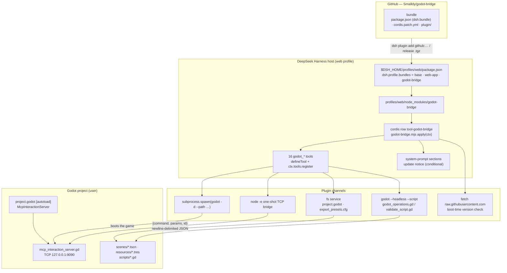
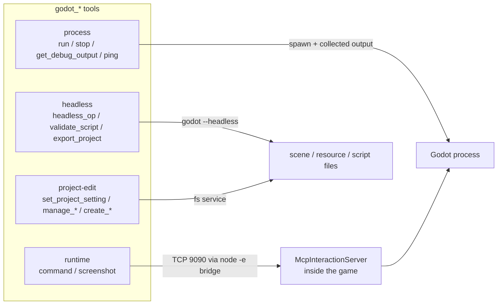
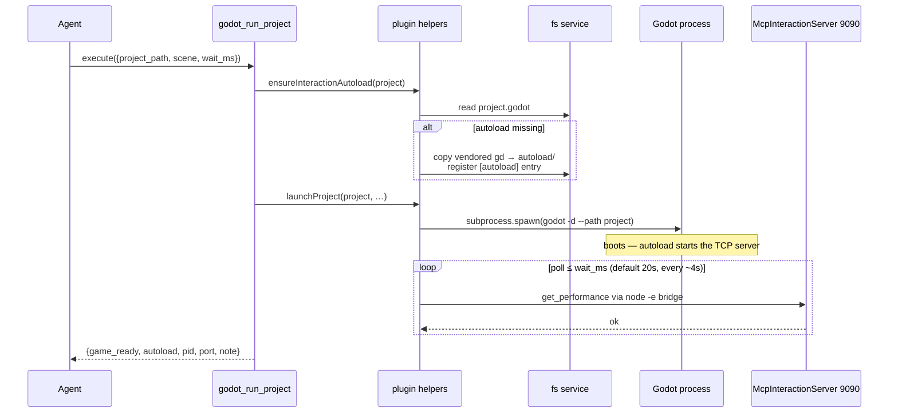
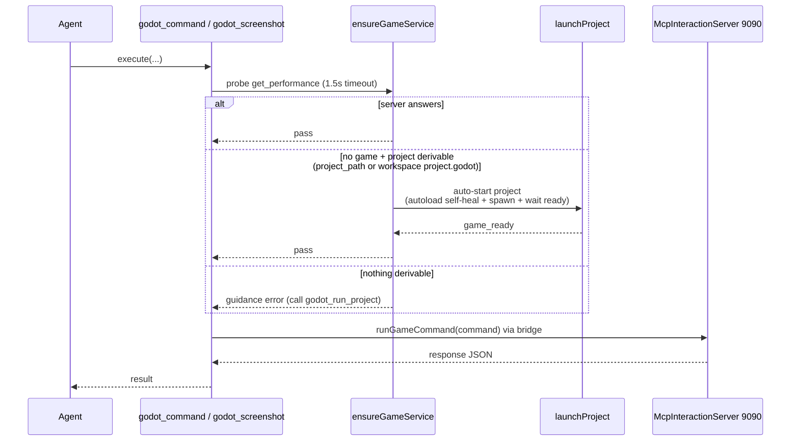

[English](ARCHITECTURE.md) | [中文](ARCHITECTURE.zh-CN.md)

# godot-bridge — architecture

## Why this exists

[godot-mcp](https://github.com/tugcantopaloglu/godot-mcp) is an MCP server (stdio JSON-RPC) wrapping three layers of real work:

1. **Process management** — `spawn(godot -d --path <project>)`, collect output, kill on demand.
2. **Runtime game control** — connect to the game's `McpInteractionServer` autoload on **TCP 127.0.0.1:9090** with newline-delimited JSON `{command, params, id}`; ~130 `game_*` tools map onto these commands.
3. **Headless static operations** — `godot --headless --path <project> --script godot_operations.gd <op> <json>` (scene edits, script validation, project creation).

The MCP layer itself contributes nothing but an outer JSON-RPC shell. DeepSeek Harness already has native equivalents for everything:

| layer | godot-mcp | godot-bridge |
| --- | --- | --- |
| process | Node `spawn` | host `subprocess.spawn` (same args) |
| runtime | TCP 9090 JSON | same TCP 9090 JSON via a one-shot `node -e` bridge |
| headless | `godot --headless …` | included: `godot_headless_op` + `godot_validate_script` over vendored `godot_operations.gd` / `validate_script.gd` |

Crucially, **the game side does not know MCP exists**: `mcp_interaction_server.gd` is a plain TCP JSON server. Replacing the MCP server requires zero game-side changes; `project.godot` autoloads stay as-is.

## The TCP bridge

The dynamic sandbox and the preset environment expose no raw `net` socket to plugin code, so each command spawns a short-lived `node -e` bridge:

```
node -e "<bridge>" <command> <paramsJson>
```

The bridge connects to 127.0.0.1:9090, writes one `{command, params, id:1}\n`, prints the first complete response line, and exits. The game server is single-connection with a `_busy` flag, so this connection-per-command model is a perfect match. `argv[1]`/`argv[2]` carry the command and params (`node -e` puts extra args at index 1+).

## Sandbox interaction (the important one)

DSH's file sandbox (`workspace-write`) restricts writes to the workspace + temp areas. The **shell executor** (pwsh/bash tools) applies that policy to the whole process tree (Windows restricted-token runner), so launching Godot from a shell tool crashes it: Godot writes `user://` (= `%APPDATA%\Godot\app_userdata\<project>\`, startup logs) and dies with `Failed to open 'user://logs/…'` → signal 11.

godot-bridge spawns through the harness's **raw `subprocess` service** — the unconfined primitive the shell executor itself uses internally — so Godot runs normally. Do not launch the game through pwsh/bash tools in a sandboxed session; use `godot_run_project`.

## Tool model

All tools return the game's response JSON verbatim (canonical value validated against `{type:'object', additionalProperties:true}`), rendered as text. Tool calls are exclusive by default (no `isConcurrencySafe`), matching the single-command game server.

## Architecture diagrams

### System overview



### Tool channels



### godot_run_project — launch flow



### Runtime tool pre-flight (self-healing guard)



## Known behavior notes

- `eval` compile errors pause a debug-mode game at the debugger (identical to godot-mcp). Recover with `godot_stop_project` + `godot_run_project`; write dynamic-access code (`node.get("prop")`) to dodge static typing.
- `godot_get_debug_output` is incremental (offset-based readers).
- The configured Godot path must be the real exe; a version-manager shim exits immediately and orphans the real process.
