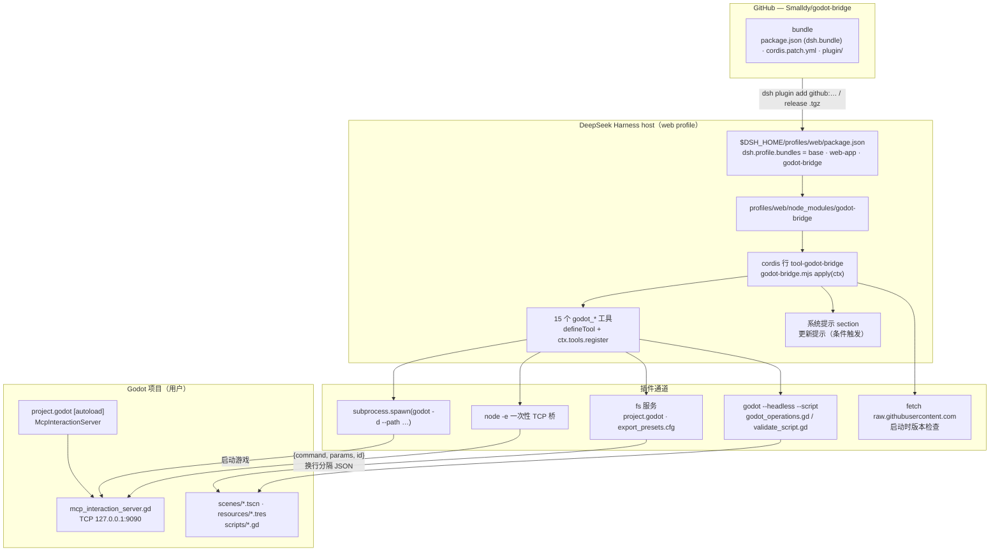
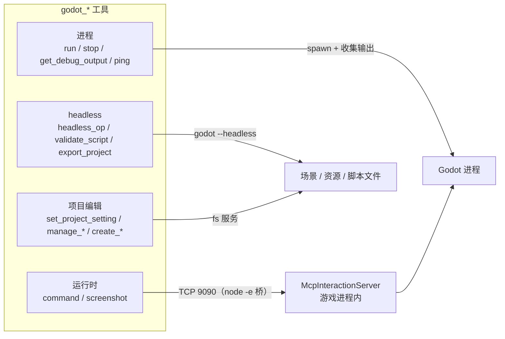
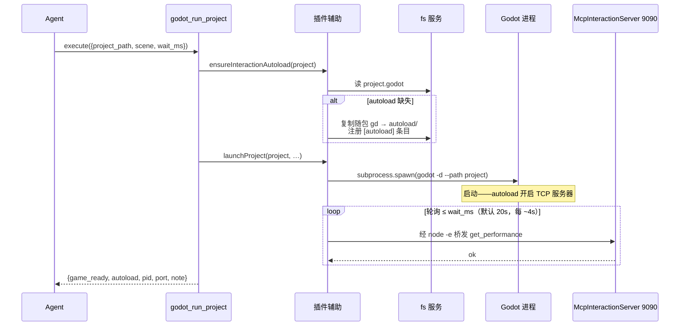
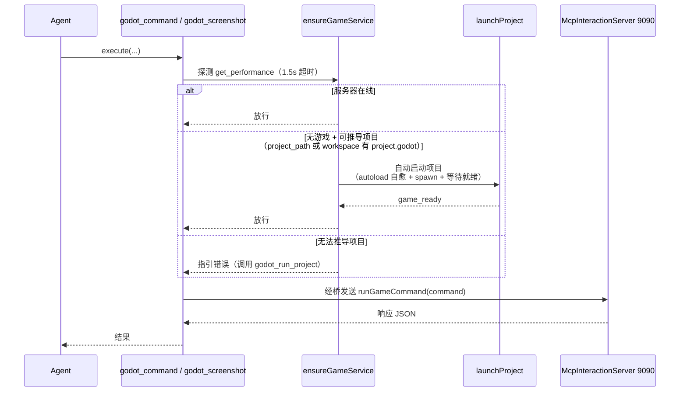

[English](ARCHITECTURE.md) | **中文**

# godot-bridge — 架构说明

## 为什么存在

[godot-mcp](https://github.com/tugcantopaloglu/godot-mcp) 是一个 MCP 服务器（stdio JSON-RPC），包了三层真正的活：

1. **进程管理** — `spawn(godot -d --path <project>)`、收集输出、按需杀掉。
2. **运行时游戏控制** — 连接游戏内 `McpInteractionServer` autoload 的 **TCP 127.0.0.1:9090**，用换行分隔 JSON `{command, params, id}` 通信；约 130 个 `game_*` 工具映射到这些命令。
3. **headless 静态操作** — `godot --headless --path <project> --script godot_operations.gd <op> <json>`（场景编辑、脚本校验、项目创建等）。

MCP 层本身除了一个外层 JSON-RPC 外壳外什么都没贡献。DeepSeek Harness 对每一层都有原生等价物：

| 层 | godot-mcp | godot-bridge |
| --- | --- | --- |
| 进程 | Node `spawn` | host `subprocess.spawn`（同样参数） |
| 运行时 | TCP 9090 JSON | 同一 TCP 9090 JSON，经一次性 `node -e` 桥 |
| headless | `godot --headless …` | 已实现：`godot_headless_op` + `godot_validate_script`，基于随包内置的 `godot_operations.gd` / `validate_script.gd` |

关键在于：**游戏侧根本不知道 MCP 的存在**——`mcp_interaction_server.gd` 只是一个普通 TCP JSON 服务器。替换 MCP 服务器不需要改游戏侧任何东西；`project.godot` 的 autoload 原样保留。

## TCP 桥

动态沙箱和预设环境都不向插件代码暴露原始 `net` socket，所以每条命令拉起一个短命的 `node -e` 桥：

```
node -e "<bridge>" <command> <paramsJson>
```

桥连接 127.0.0.1:9090，写入一行 `{command, params, id:1}\n`，打印第一条完整响应行，退出。游戏服务器是单连接 + `_busy` 标志，这种按命令短连接的模型完美匹配。命令和参数位于 `argv[1]`/`argv[2]`（`node -e` 把额外参数放在索引 1 之后）。

## 沙箱交互（重点）

DSH 的文件沙箱（`workspace-write`）只允许写 workspace 和临时目录。**shell 执行器**（pwsh/bash 工具）把该策略应用到整个进程树（Windows 受限令牌执行器），所以从 shell 工具启动 Godot 会崩：Godot 要写 `user://`（= `%APPDATA%\Godot\app_userdata\<项目名>\`，启动日志），被拒后报 `Failed to open 'user://logs/…'` → signal 11。

godot-bridge 走 harness 的**原始 `subprocess` 服务**——shell 执行器自己内部也在用的不受限原语——所以 Godot 正常运行。**不要在沙箱会话里用 pwsh/bash 工具启动游戏**，用 `godot_run_project`。

## 工具模型

所有工具原样返回游戏的 JSON 响应（规范化值按 `{type:'object', additionalProperties:true}` 校验），以文本渲染。工具调用默认排他（无 `isConcurrencySafe`），与单命令游戏服务器匹配。

## 架构图

### 系统总览



### 工具通道



### godot_run_project — 启动流程



### 运行时工具前置守卫（自愈）



## 已知行为说明

- `eval` 编译错误会让 debug 模式的游戏卡在调试器（与 godot-mcp 完全相同）。用 `godot_stop_project` + `godot_run_project` 恢复；写动态访问代码（`node.get("prop")`）绕开静态类型推断。
- `godot_get_debug_output` 是增量式的（offset 读取器）。
- 配置的 Godot 路径必须是真实 exe；版本管理器 shim 会立即退出并把真实进程变孤儿。
